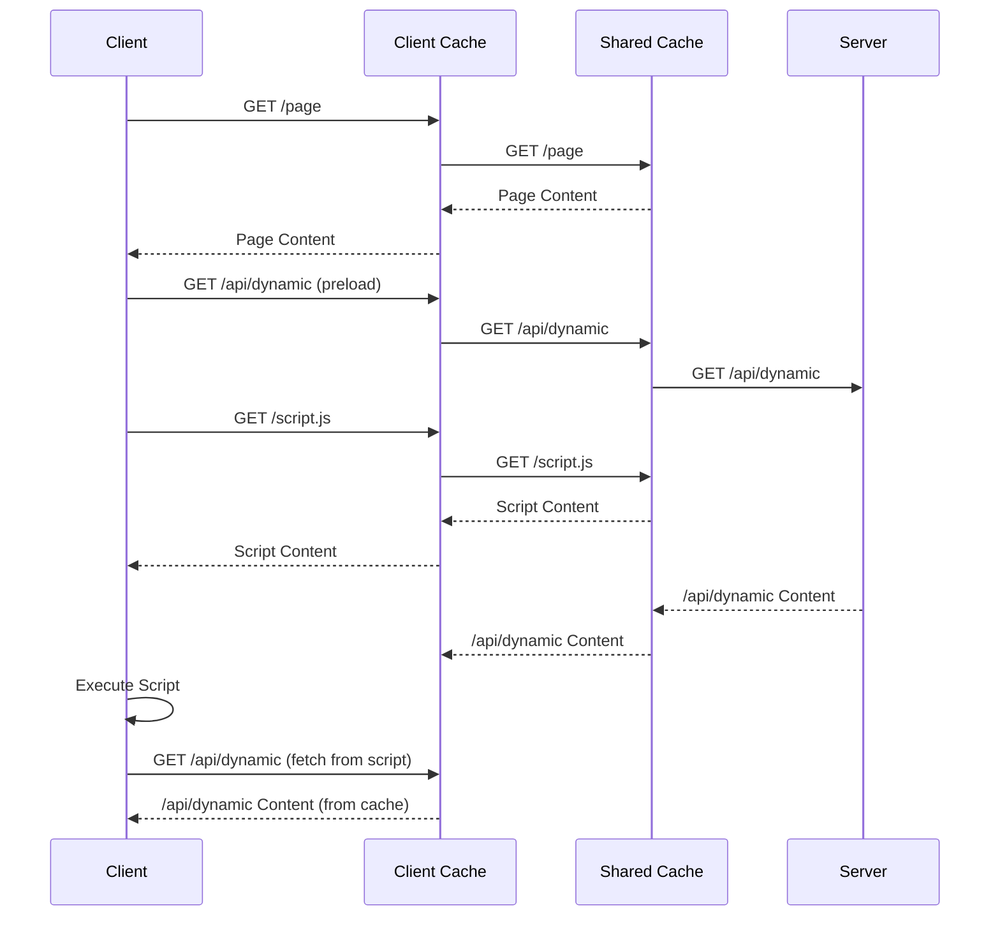

# Next.js Example: SSR Publicly Cacheable Content And Preload Dynamic Content

This is an incomplete port of [the following TanStack Start example](https://github.com/NawfelBgh/tanstack-start-example-ssr-cacheable-preload-dynamic/) to Next.js. It demonstrates the pattern of server-side rendering publicly-cacheable page content, while using `<link rel="preload">` tags to accelerate the fetching of non-cacheable user-specific content.

`<link rel="preload">` tags allow preloading dynamic page data as soon as the client loads the page's head element and before any script is loaded. This gives performance similar to and sometimes better than streaming the whole page content due to better cache efficiency. See [comparison article](https://nawfelbgh.github.io/blog/when-pre-loading-beats-streaming-the-caching-advantage/).



If the server takes a long time to respond to the preloading fetch, and the script ends up fetching the same URL before the preload is finished, the browser does not send a second request. Instead, it waits for the preload to finish and reuses its response. All major browsers conform to this behavior, which the [spec](https://html.spec.whatwg.org/multipage/links.html#link-type-preload) describes in opaque terms:

> To consume a preloaded resource [...]
>
> 9. If entry's response is null, then set entry's on response available to onResponseAvailable.
> 10. Otherwise, call onResponseAvailable with entry's response.

---

Compared to the TanStack repo, this Next.js repo contains only one version, which uses classic API routes to get dynamic content, on the branch [main](https://github.com/NawfelBgh/nextjs-example-ssr-cacheable-preload-dynamic/tree/main). There is no version preloading server functions because of how they are implemented in Next.js: they work by sending requests to the route `/` with special headers to identify server functions. This is not compatible with preloading through `<link rel="preload">` tags, because those tags cannot specify custom headers.

## Classic API routes version

### Implementation details

- The app defines two API routes for getting dynamic user-specific information:
    - [/api/user](app/api/user/route.tsx) fetches user name and profile pic
    - [/api/post/$postId/like](app/api/post/[postId]/like/route.ts) fetches whether the user likes a given post
- Both endpoints:
    - use cookies to get the user session,
    - use a 2-second setTimeout to simulate slow network loading, and
    - are accessed through TanStack query wrappers for ease of consumption.
- The page's [layout](app/layout.tsx) inserts a preload tag to the head of the page to preload `/api/user` when rendered on the server. On the client, it renders the [UserInfo](components/UserInfo.tsx) component which fetches `/api/user` reusing the already preloaded content.
- Likewise, the page [/posts/$postId](app/posts/[postId]/page.tsx) inserts a preload tag to the head of the page to preload `/api/post/$postId/like` when rendered on the server. On the client, it renders the [UserLike](components/UserLike.tsx) component which fetches `/api/post/$postId/like` reusing the already preloaded content.
- On client-side navigation, dynamic page data is loaded by route loaders, instead of relying on `<link rel="preload">` tags. This way, page prefetching on link hover does take into account the dynamic data.
- All pages set the Cache-Control header to `public, max-age=600`.

## Getting Started

From your terminal:

```sh
npm install
npm run dev
```

This starts your app in development mode, rebuilding assets on file changes.

## Build

To build the app for production:

```sh
npm run build
```
